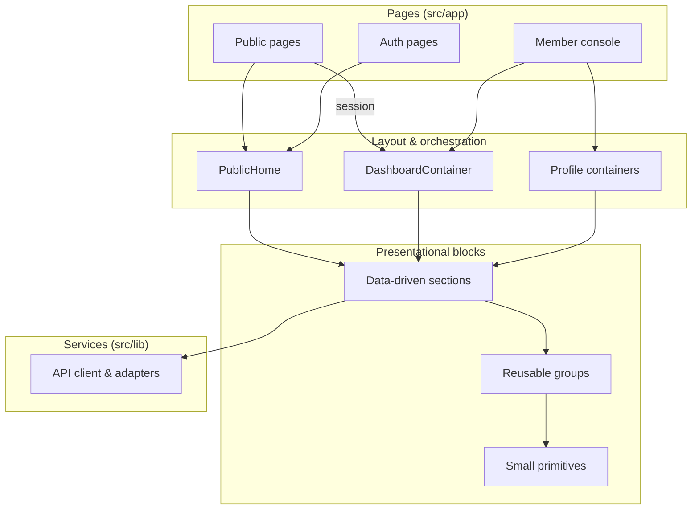
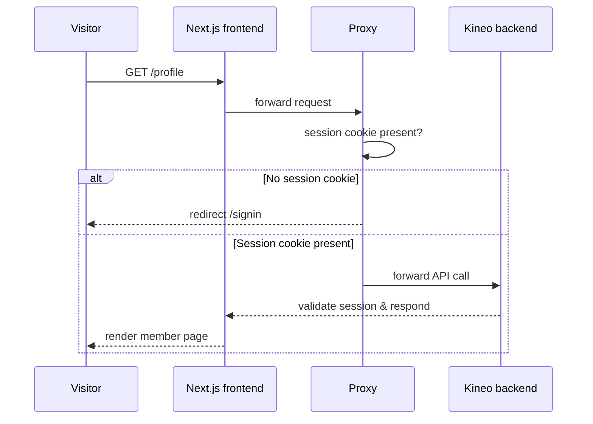

# Kineo — Frontend

> Web frontend for **Kineo**, a modern platform dedicated to medical locum work in France.

Kineo connects **established practitioners** with **locum doctors**. Publish a cover
opening in minutes, receive verified applications, and follow every application to the day of
the locum assignment — on both sides of the table.

---

## Features

**For established practitioners**

- Publish a locum opening in ~2 minutes: dates, retrocession, expectations.
- Receive applications from RPPS-verified locums and choose the right match.

**For locum doctors**

- Browse open openings near you; review dates and retrocession at a glance.
- Apply in one click with a personalized message.

**Shared**

- Real-time status tracking on every application — sent, viewed, accepted, refused.
- Verified identities (RPPS) checked before activation.
- Free during beta, no commitment.

**Member console**

- Personal dashboard: quick actions, key stats, application feed and reactivity panel.
- Full profile management: create & edit your professional profile, account
  information, email change, avatar, and account deletion.

---

## Tech stack

| Area     | Choice                |
|----------|-----------------------|
| Framework| Next.js 16 (App Router)|
| Language | TypeScript 5          |
| Runtime  | React 19              |
| Styling  | Tailwind CSS 4        |
| Auth     | Better-Auth (session) |
| Tooling  | bun · Biome           |

---

## Getting started

Prerequisites: [bun](https://bun.sh), a Node-compatible runtime, and a running instance of
the Kineo backend (`kineo-nest-backend`).

Copy `.env.example` to `.env` and configure the backend / base-URL variables.

```bash
bun install        # install dependencies
bun run dev        # start the dev server (port 3001)
bun run build      # production build (type-check + compile)
bun run start      # serve the production build
bun run lint       # lint & format check (Biome)
bun run format     # auto-format code (Biome)
```

### Scripts

| Command           | Description                             |
|-------------------|-----------------------------------------|
| `bun run dev`     | Development server (port 3001)          |
| `bun run build`   | Production build (type-check + compile) |
| `bun run start`   | Serve the production build              |
| `bun run lint`    | Lint & format check (Biome)             |
| `bun run format`  | Auto-format code (Biome)                |

---

## Routes

| Path                  | Purpose                                    |
|-----------------------|--------------------------------------------|
| `/`                   | Home — member dashboard or marketing page  |
| `/signin` · `/signup` | Authentication                             |
| `/forgot-password` · `/reset-password` | Password recovery        |
| `/verify-email`       | Email verification                        |
| `/profile` (`/create`, `/edit`) | Member profile management          |
| `/terms`              | Legal / terms of use                      |

Protected routes (`/profile`, `/dashboard`, `/settings`) are guarded by an optimistic
session-cookie check that redirects guests to `/signin`.

---

## Project structure

```text
src/
├── app/              # Routes (App Router) — thin page shells
│   ├── (site)/       # Routes behind the shared site layout
│   │   ├── page.tsx  # Home: member dashboard or marketing content
│   │   ├── profile/  # Profile management
│   │   └── terms/
│   ├── signin/ signup/
│   ├── forgot-password/ reset-password/
│   └── verify-email/
├── components/       # Reusable presentational blocks
└── lib/              # Services & shared logic
│   ├── dashboard/    # Dashboard service + presentation contracts
│   ├── types/        # Raw API types
│   └── …             # Auth client, marketing content, navigation, formatting
└── proxy.ts          # Next 16 proxy: optimistic auth guard
```

---

## Architecture

The frontend is organized around a **page shell → presentational blocks → service layer**
separation. Pages are thin shells that delegate to layout and orchestration containers,
and reusable presentational blocks are assembled from small, focused primitives.



### Server-rendered by default

Almost the whole app renders on the server. The home page resolves the session
server-side and serves either the member dashboard or the marketing content — no
public-content hydration, no flash after load. Only genuinely interactive pieces
(auth forms, the header, data-loading containers) are client components.

### Service layer

Components never talk to the backend directly. A service layer (`src/lib`) fetches
data through a shared API client, adapts raw responses into presentation contracts,
and keeps editorial content and French labels separate from components.

---

## Authentication

Authentication relies on **Better-Auth** sessions. The Next proxy performs an
optimistic session-cookie check on protected routes and redirects guests to the
sign-in page; real validation happens in the backend on every API call.



---

## Performance

- Server-rendered pages with no public-content hydration.
- Self-hosted fonts (`next/font`) — zero external requests.
- Inline SVG icons — no bitmap assets.
- Streaming shell on the dynamic home route for instant perceived load.

---

## Roadmap

The platform is evolving beyond the core user journey. Priorities below, in rough order:

### Phase 1 — Core product experience
- **Live listings** — one app to publish & browse openings
  (`/listings`, `/practices`), with filters by speciality, dates and location.
- **Application workflow** — apply with a personalized message, manage and
  track every status from a dedicated page (`/applications`).
- **Pricing & "how it works" pages** — fill the product navigation with real
  content instead of placeholder links.

### Phase 2 — Trust & network effects
- **Public testimonials** — social proof from beta users on the marketing site.
- **Verified profile depth** — richer RPPS-backed credentials, speciality and
  experience badges shown to both sides.
- **Reactivity & response-time signals** — surface average response times to
  encourage faster, more reliable matching.

### Phase 3 — Reliability & scale
- **Partial prerendering** — one static shell, streamed dynamic content.
- **Web Vitals monitoring** — instrument and report core performance metrics.
- **Design-system consolidation** — unify component naming and surface styles
  across pages.

### Not decided yet
- Notifications (email / push) and calendar sync for openings.
- Feedback & ratings between practitioners after a completed assignment.